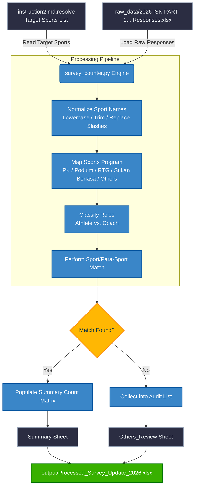
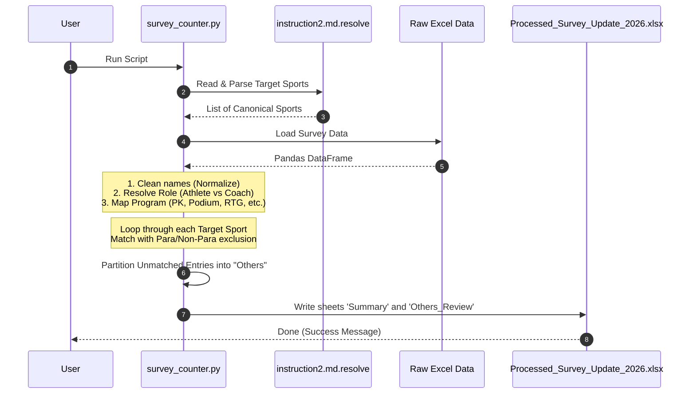

# 📊 ISN Satisfaction Survey Response Counter

An automated processing utility designed for the **Institut Sukan Negara (ISN) 2026 Athletes and Coaches Satisfaction Survey on Sports Science & Sports Medicine Services**. This system maps, counts, and categorizes raw survey responses into a clean, structured reporting structure, removing manual spreadsheet work.

---

## 📖 Project Brief

The ISN conducts surveys across various sports programs: **Pelapis Kebangsaan (PK)**, **Podium**, **RTG (Road to Gold)**, **Sukan Berfasa**, and other regional or unclassified categories. 

Respondents can be either **Athletes** or **Coaches**. Since survey entries often contain typos, formatting variations, or custom entries under "Others", this utility:
1. Standardizes raw responses against an explicit **sports list source of truth**.
2. Dynamically distinguishes between Olympic sports and **Para-sports** (e.g., *Archery* vs. *Para Archery*).
3. Segregates unmatched entries into an audit sheet called **`Others_Review`** for manual verification.
4. Outputs an Excel spreadsheet ready for direct copy-paste to master files or Google Sheets.

---

## 🏗️ System Architecture

The following diagram represents the system data flow and processing pipelines:



---

## 🔄 Detailed Workflow

The execution pipeline follows these sequence of steps:



1. **Target Sports Resolution**: Reads the sports list directly from `instruction2.md.resolve`. It parses standard names and supports updating target sports dynamically.
2. **Text Normalization**: Standardizes entries by converting text to lowercase, trimming leading/trailing whitespace, replacing slashes with spaces, and resolving common spelling or naming variants (e.g., matching *Hoki Dewan* to *Indoor Hockey*).
3. **Program Mapping**: Maps varying program text responses into clean, standardized labels:
   * `Pelapis Kebangsaan` / `PK` $\rightarrow$ **PK**
   * `Podium` $\rightarrow$ **Podium**
   * `Road to Gold` / `RTG` $\rightarrow$ **RTG**
   * `Sukan Berfasa` $\rightarrow$ **Sukan Berfasa**
   * Any unmatched program $\rightarrow$ **Others**
4. **Role Classification**: Checks the role response column to classify the respondent as an `Athlete` or `Coach`.
5. **Deterministic Sport Matching**: Matches normalized user inputs against the target sports list. It guarantees that normal sports do not overlap with para-sports (e.g. "Para Athletics" won't be counted under "Athletics / Olahraga" because the presence of keyword "para" restricts matches).
6. **Report Generation**: Builds the consolidated table and writes the output file.

---

## 📁 Directory Structure

```text
SatisfactioSurvey_ResponseCounter/
├── .git/
├── .gitignore
├── README.md                   <-- This documentation
├── instruction2.md.resolve     <-- Source of truth sports list
├── requirements.txt            <-- Project dependencies
├── survey_counter.py           <-- Automation execution engine
├── raw_data/                   <-- Input folder (Place survey responses here)
│   └── 2026 ISN PART 1_ Athletes and Coaches Satisfaction Survey on Sports Science & Sports Medicine Services (Responses).xlsx
└── output/                     <-- Output folder (Generated reports)
    └── Processed_Survey_Update_2026.xlsx
```

---

## ⚙️ Setup & Running

### Prerequisites
- Python 3.10 or higher
- Git

### Installation & Initialization
1. **Clone the repository**:
   ```bash
   git clone <repository_url>
   cd SatisfactioSurvey_ResponseCounter
   ```

2. **Initialize a Virtual Environment**:
   * **Windows (PowerShell)**:
     ```powershell
     python -m venv venv
     .\venv\Scripts\Activate.ps1
     python -m pip install --upgrade pip
     pip install -r requirements.txt
     ```
   * **macOS/Linux**:
     ```bash
     python3 -m venv venv
     source venv/bin/activate
     python3 -m pip install --upgrade pip
     pip install -r requirements.txt
     ```

### Execution
Run the pipeline to process the survey responses:
```powershell
.\venv\Scripts\python survey_counter.py
```

---

## 🛠️ Maintenance & Exception Auditing

> [!IMPORTANT]
> The automation relies on a strict definition of target sports to ensure maximum reporting precision.

### 1. Modifying Target Sports
To add, remove, or modify target sports:
* Open `instruction2.md.resolve`.
* Modify the list at the top of the file.
* Save the file and re-run `survey_counter.py`. The summary output columns and sport rows will adjust automatically.

### 2. Handling the "Others_Review" Sheet
* The script outputs an `Others_Review` worksheet inside the generated Excel file containing responses that couldn't be matched automatically.
* **Action Item**: Always check `Others_Review` after each run. If a sport was not matched due to a typo or a new name variant, add the appropriate normalization rule to the `normalize_name()` function in `survey_counter.py` or append/correct the sport in `instruction2.md.resolve`.
